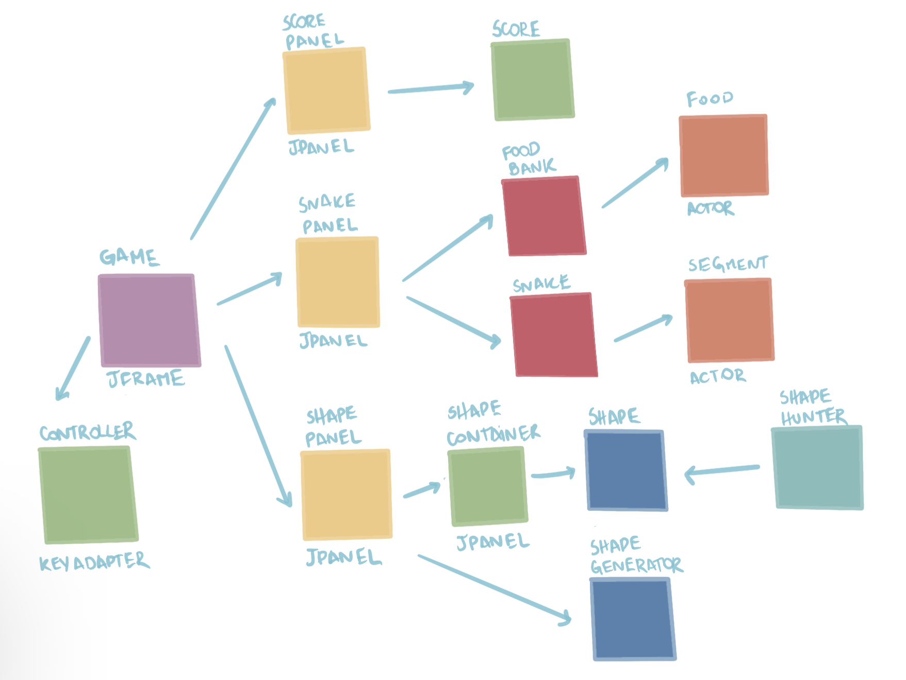
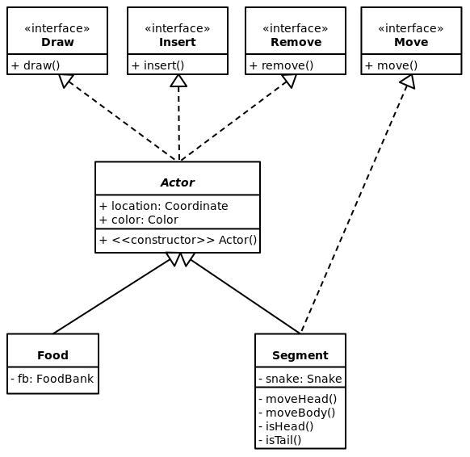
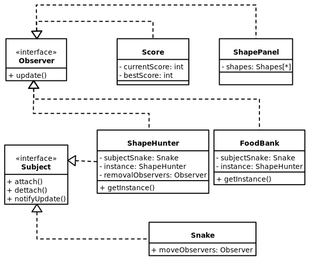
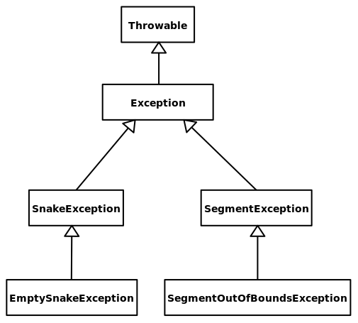
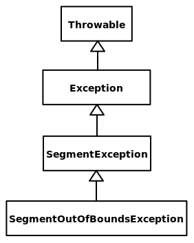

# Projeto `Snetrix`

<!-- vim-markdown-toc GFM -->

* [Descrição Resumida do Projeto/Jogo](#descrição-resumida-do-projetojogo)
* [Equipe](#equipe)
* [Arquivo Executável do Jogo](#arquivo-executável-do-jogo)
* [Slides do Projeto](#slides-do-projeto)
    * [Slides da Prévia](#slides-da-prévia)
    * [Slides da Apresentação Final](#slides-da-apresentação-final)
* [Relatório de Evolução](#relatório-de-evolução)
* [Diagrama da Arquitetura do Jogo](#diagrama-da-arquitetura-do-jogo)
* [Destaques de Código](#destaques-de-código)
    * [Destaque de Algoritmo](#destaque-de-algoritmo)
        * [Diagrama](#diagrama)
        * [Código](#código)
        * [Justificativa](#justificativa)
    * [Destaques de Orientação a Objetos](#destaques-de-orientação-a-objetos)
        * [Diagrama](#diagrama-1)
        * [Código](#código-1)
        * [Justificativa](#justificativa-1)
    * [Destaques de *Design Pattern*](#destaques-de-design-pattern)
        * [Diagrama](#diagrama-2)
        * [Código](#código-2)
        * [Justificativa](#justificativa-2)
* [Detalhamento das Interfaces](#detalhamento-das-interfaces)
    * [Interface `Draw`](#interface-draw)
* [Plano de Exceções](#plano-de-exceções)
    * [Diagrama da hierarquia de exceções](#diagrama-da-hierarquia-de-exceções)
    * [Descrição das classes de exceção](#descrição-das-classes-de-exceção)
* [Conclusões e Trabalhos Futuros](#conclusões-e-trabalhos-futuros)

<!-- vim-markdown-toc -->

# Descrição Resumida do Projeto/Jogo


O jogo Snetrix foi criado a partir da junção de dois jogos clássicos: Snake e
Tetris. Durante o jogo, o usuário deve, por meio das setas de seu teclado,
movimentar a cobra para que a mesma se alimente de comidas de cores
pré-estabelecidas, a fim de formar com seu corpo um formato específico mostrado
na tela. Ao fazê-lo, a cobra perde a parte do corpo que formou o formato e o
usuário pontua. O jogo termina em três condições: quando a cobra forma um
formato que inclui sua cabeça (ou seja, a cobra desaparece), quando a cobra
colide consigo mesma e quando a cobra encosta em uma das bordas do espaço de
jogo.

# Equipe
* Luiza Coelho de Souza - 247257
* Pedro Sader Azevedo - 243245

# Arquivo Executável do Jogo

[📁 snetrix.jar](snetrix.jar)

# Slides do Projeto

## Slides da Prévia
[🔗 Link](https://docs.google.com/presentation/d/1VjUHh6TvXTcX7MuGttllpbNoGelKi59lC5gMIKN51RE/edit#slide=id.p)

## Slides da Apresentação Final
[🔗 Link](https://docs.google.com/presentation/d/1AYmHwLMVmCIzhkl_hy9OlpR2MiHO1PmSlwrjADaJJ_M/edit#slide=id.p)

# Relatório de Evolução

> Relatório de evolução, descrevendo as evoluções do design do projeto, dificuldades enfrentadas, mudanças de rumo, melhorias e lições aprendidas. Referências aos diagramas e recortes de mudanças são bem-vindos.

# Diagrama da Arquitetura do Jogo

> 

Neste diagrama pode-se perceber todos os componentes principais do jogo. A classe principal, `Game`, é por onde tudo se conecta, e a ela estão ligadas a classe `Controller` (a qual recebe e repassa os input pelo teclado do jogador) e os três principais `JPanels` do jogo. Esses `JPanel`s são: `ScorePanel` (ao qual esta ligado o `Score` e o coloca em display), `SnakePanel` (ao qual estão ligados todos os elementos e classes que se relacionam diretamente com a `Snake`) e `ShapePanel` (ao qual estão ligados todos os elementos e classes que se relacionam com os `Shape`s).

Também no diagrama estão presentes algumas das principais classes do jogo como `ShapeHunter` e `ShapeContainer`, os elementos da herança de `Actor` (`Segment` e `Food`) e elementos adicionais que foram necessários serem adicionados durante a construção do jogo, como um `JPanel` adicional, o `ShapeContainer`.

# Destaques de Código

## Destaque de Algoritmo

### Diagrama


### Código

```java
public Shape generate(int size, Color color) {
    ArrayList<Coordinate> blocks = new ArrayList<Coordinate>();
    Coordinate latestBlock = new Coordinate(0, 0);
    blocks.add(latestBlock);
    ...
    Coordinate newBlock;
    for (int i = 0; i < size; i++) {
        newBlock = latestBlock.clone();
        newBlock.towards(Direction.randomDirection());
        if (blocks.contains(newBlock)) {
            i--;
        } else {
            blocks.add(newBlock);
            latestBlock = newBlock;
            ...
        }
        ...
    return new Shape(blocks, color, width, heigth, minX, minY);
}

// sobrecarga
public Shape generate(int size) {
    return generate(size, RandomColor.generate());
}

// sobrecarga
public Shape generate(){
    Random rand = new Random();
    return generate(rand.nextInt(this.minSize, this.maxSize));
}
```

### Justificativa

O destaque algorítmico do projeto foi o código de geração de `Shape`s. Isso pode parecer trivial, mas tínhamos o desafio de gerar formatos que pudessem ser feitos pela `Snake` continuamente. Para esse propósito, escolhemos a representação de lista de coordenadas (`ArrayList<Coordinate>`) para as posições dos blocos dos `Shape`s, ao invés de matrizes.

Enfim, o algoritmo funciona simulando um percurso <u>válido</u> e <u>aleatório</u> de uma Snake. Para isso, ele começa inserindo a coordenada (0, 0) na lista e sorteia uma direção (`Direction`) para inserir uma nova coordenada a partir da última coordenada inserida. Isso é repetido até que seja atingido o tamanho desejado para o `Shape`. Por fim, sobrecarregamos o método acima para gerar `Shape`s de tamanho e cor aleatórios, caso estes não sejam fornecidos como parâmetros:

Incluímos também um diagrama de UML resumindo a interação das classes envolvidas nesse algoritmo. Nele, é possível perceber que alavancamos orientação a objetos nesse exemplo visto que delegamos diferentes etapas do algoritmo a diferentes objetos (geração de direção aleatória → `Direction`, geração de cor aleatória → `RandomColor`, geração de nova coordenada na direção especificada → `Coordinate`, etc).

## Destaques de Orientação a Objetos

### Diagrama



### Código

```java
public abstract class Actor implements Remove, Insert, Draw {
    private Coordinate location;
    private Color color;

    public Actor(){
        this.location = SnakePanel.getInstance().getRandomCoordinate();
        this.color = RandomColor.generate();
    }
```

### Justificativa

> Explicação de como a POO foi usada e quais suas vantagens, referenciando o diagrama.

O uso da classe abstrata `Actor` como generalização das peças individuais do jogo, `Segment` e `Food`, foi um bom exemplo de uso da orientação a objetos em nosso projeto. Ela nos permitiu o estabelecimento de um "molde" para as classes concretas, incluindo atributos (localização e cor), métodos (construtor sem parâmetros, *getters* e *setters*), e implementações (remoção, inserção, e renderização) comuns.

Para decidir o que incluir na classe abstrata, foi necessário decidir os aspectos comuns à todas as peças do jogo. Por exemplo: os `Segment`s se movem mas as `Food`s são estáticas, então a interface de movimento `Move` não é implementada pela classe abstrata parente de ambos. Assim, dentre elas, apenas a classe `Segment` implementa essa interface, como é possível observar no diagrama.

Mesmo este sendo um destaque de orientação a objetos, vale mencionar que as interfaces `Draw`, `Insert`, `Remove`, e `Move` são parte do *design pattern* de estratégia, que utilizamos profusamente em nosso código. Falaremos mais sobre elas na seção de [Detalhamento das Interfaces](#detalhamento-das-interfaces).

## Destaques de *Design Pattern*

### Diagrama



### Código

```java
@Override // Snake
public void notifyUpdate() {
    for (Observer obs : moveObservers) {
        obs.update();
    }
}
```

```java
@Override // ShapeHunter
public void notifyUpdate() {
    for (Observer obs : removalObservers) {
        obs.update();
    }
}
```

### Justificativa

O principal destaque de *design pattern* foi a utilização de observadores polimórficos. Isso foi implementado para duas situações a serem observadas: os movimentos realizados pela `Snake`, e as remoções realizadas pelo `ShapeHunter`.

No primeiro caso, o método de atualização da classe `FoodBank` verifica se a posição da cabeça da `Snake` coincide com a posição de alguma `Food` (se isso acontecer, a `Food` coincidente é removida e uma nova `Food` é gerada e posicionada). Além disso, o método de atualização da classe `ShapeHunter` verifica se a `Snake` formou algum `Shape` com o seu corpo (se isso acontecer, os `Segments` que integraram o formato são removidos).

No segundo caso, o método de atualização da classe `ShapePanel` remove o primeiro `Shape` da fila, desloca a fila, e requisita (à instância de `ShapeGenerator`) a geração de um novo `Shape` para ocupar o último lugar da fila. Além disso, o método de atualização da classe `Score` aumenta a pontuação do jogador.

Isso permitiu a criação de listas de tipo `Observer`, que podem ser iteradas para evocar polimorficamente os métodos de atualização dos objetos que as compoem.

Essa abordagem genérica tem como vantagem a facilidade de implementar novas respostas às situações observadas. Por exemplo, seria possível adicionar um objeto `ComboDetector` que observa cada movimento da `Snake` para detectar combinações de formatos em seu corpo.


# Detalhamento das Interfaces

## Interface `Draw`

Interface provida por qualquer objeto que se mova (ex: `Segment`, `Snake`).

```java
public interface Draw {
    public void draw(Graphics g);
}
```

Método | Objetivo
-------| --------
`move` | Move o objeto. Note que esse método não contém parâmetros, então a especificações do movimento (ex: direção, velocidade) precisam ser "decididas" pelo próprio objeto.

# Plano de Exceções

## Diagrama da hierarquia de exceções

Plano inicial | Plano final
----- | ----- 
 | 

## Descrição das classes de exceção

Classe | Descrição | Implementada
----- | ----- | ------
`SegmentException` | Engloba todas as exceções relacionadas à classe Segment. Usamos ela diretamente quando o método `moveHead()`, da class Segment, é chamado em um Segment que não é a cabeça da Snake. | ✔️
`SegmentOutOfBoundsException` | Indica tentativa de acesso a um segmento fora do alcance. Muitas vezes foi chamado a partir do `catch` de um `IndexOutBoundsException`. | ✔️
`SnakeException` | Engloba todas as exceções relacionadas à classe Snake. | ❌
`SnakeException` | Indica situação em que Snake fica com a sua lista de Segments vazia. Decidimos não implementar isso como excessão, pois tornou-se uma mecânica do jogo e, portanto, uma situação esperada | ❌

# Conclusões e Trabalhos Futuros

Acreditamos que nosso projeto Snetrix teve um resultado ótimo e dentro do esperado, mas encontramos diversas dificuldades durante o caminho e tivemos que seguir caminhos diferentes do que pensavamos inicialmente. A ideia de construir todos os elementos como listas e matrizes foi rapidamente descartada ao passo que fomos descobrindo como seria o movimento da Snake e como funcionariam os principais métodos que tratavam do Shape, que necessitariam sabem qual era o bloco seguinte e o anterior.

Além disso, o uso do JSwing como interface gráfica foi interessante, por um lado conseguimos aprender o necessário para fazer o jogo rodar e ser construído com a estética que esperavamos (o JSwing tornou o uso de Data desnecessário, já que todos os formatos foram desenhados com funções próprias do JSWing, como DrawRect) mas por outro lado, é um dos principais pontos a serem melhorados. Com mais estudo e tempo seria possivel criar classes separadas para Model e View (enquanto no jogo atual esses dois aspectos estão juntos, o o codigo um pouco longo), deixando o jogo com classes menores e mais organizadas, com o objetivo definido para cada uma tratando-se de JSwing.

O uso do Singleton também foi algo controverso, já que de certa maneira entendemos sua funcionalidade mas ocasionou em uma construção complicada do código, havendo que sempre notar as instância e suas atualizações.

Para ideias futuras no jogo temos alguns aspectos em mente. Melhorias no sistema de pontuação seriam a primeira ideia, a qual necessitaria de uma identificação dos Shapes sem contar a ordem (já que hoje eles são detectados na cauda), ou seja, o Shape não precisaria ser formado de uma forma contínua. Para isso poder ser realizado, deveria ocorrer uma mudança na classe ShapeHunter, mudando o método como o Shape é encontrado. A implementação de combos na pontuação, perda de pontos por algo feito, e mudanças do tipo também são possíveis melhorias a serem documentadas.

O possível uso de um Multiplayer também seria algo possível, podendo ser cooperativo ou competitivo, que deixaria o jogo com um aspecto interessante. 

Além disso, estratégias de favorecimento (como chances de spawnar Foods da cor do Shape atual ou criar Shape da cor que tiver mais Foods) também é viável, e poderia auxiliar o jogador em certos casos.

Por fim, outra mudança possível seria de interface gráfica, devido as limitações do JSwing, escolher um interface gráfica que possibilitasse a criação de um jogo com uma estética realista juntamente com a criação de um menu inicial seria uma possível melhoria futura. No geral, acreditamos que nosso jogo é algo interessante e inovador, que conseguiu cumprir com o que imaginávamos para ele inicialmente, aplicando os conceitos de POO durante diversos momentos de sua criação
