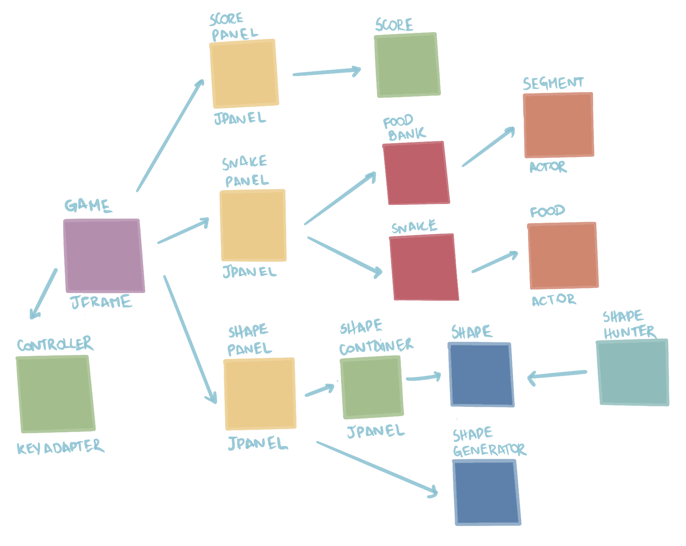

# Projeto `Snetrix`

# Descrição Resumida do Projeto/Jogo
O jogo Snetrix foi criado a partir da junção de dois jogos classicos, Snake e Tetris. Durante o jogo, o usuário deve, por meio das setas de seu teclado,
movimentar a cobra para que a mesma de alimente das comidas de cores pré-estabelecidas, a fim de formar com seu corpo, um formato específico demonstrado
na tela. Ao consegui formar, a cobra perde esse pedaço formado e o usuaário ganha pontos. O jogo termina em três condições: Quando o formato incluir a cabeça
da cobra, ou seja, a cabeça seria removida, quando a cobra encosta em si mesma ou quando encosta em uma das laterais do espaço de jogo. Por meio do uso do 
JSwing como interface gráfica foi criado o Snetrix, sendo auxiliado por diversos principios da Programação Orientada a Objetos

# Equipe
* `Luiza Coelho de Souza` - `247257`
* `Pedro Sader Azevedo` - `243245`

# Arquivo Executável do Jogo

https://github.com/javalupe/mc322/blob/main/project/snetrix.jar

# Slides do Projeto

## Slides da Prévia
> https://docs.google.com/presentation/d/1VjUHh6TvXTcX7MuGttllpbNoGelKi59lC5gMIKN51RE/edit#slide=id.p

## Slides da Apresentação Final
> https://docs.google.com/presentation/d/135kf0BXVZVBrsugQPYh4Ib1m9Wf34ob28_vCFwLOxIs/edit#slide=id.g1202975768e_0_161

# Diagramas

## Diagrama Geral da Arquitetura do Jogo

> 
